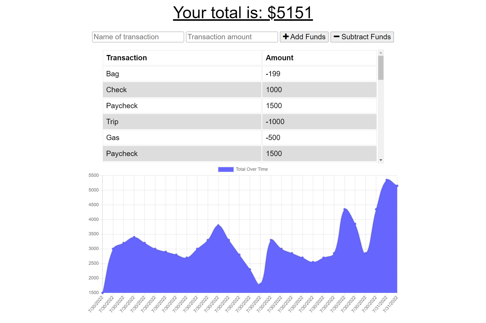

# **Budget Tracker PWA**

## **Description**
The purpose of this project was to convert an existing budget tracking website into a progressive web application (PWA). The Budget Tracker PWA allows for users to submit expenses and deposits with or without an internet connection, thereby providing offline access and functionality. 

## **Table of Contents**
[User Story](#user-story) 
[Acceptance Criteria](#acceptance-criteria) 
[License](#license) 
[Contributing](#contributing) 
[Tests](#tests) 
[Built With](#built-with) 
[Deliverables](#deliverables) 

### **User Story**
AS AN avid traveler 
I WANT to be able to track my withdrawals and deposits with or without a data/internet connection 
SO THAT my account balance is accurate when I am traveling  

### **Acceptance Criteria**
GIVEN a budget tracker without an internet connection 
WHEN the user inputs an expense or deposit 
THEN they will receive a notification that they have added an expense or deposit 
WHEN the user reestablishes an internet connection 
THEN the deposits or expenses added while they were offline are added to their transaction history and their totals are updated 

### **License**
This project is covered under the following license: ISC 
https://opensource.org/licenses/ISC

### **Contributing**
This project does not include any contributors

### **Tests**
No tests were utilized in the creation of this application.

### **Built With**
* JavaScript
* Node.js
* Express.js
* MongoDB
* Mongoose
* MongoDB Atlas
* Heroku

### **Deliverables**
**Screenshot of Budget Tracker PWA:**

**Website URL for Budget Tracker PWA:** 
https://evening-eyrie-52576.herokuapp.com/
